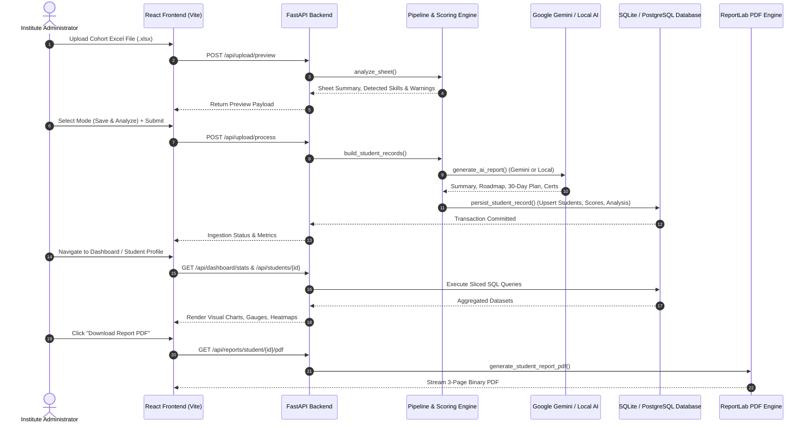
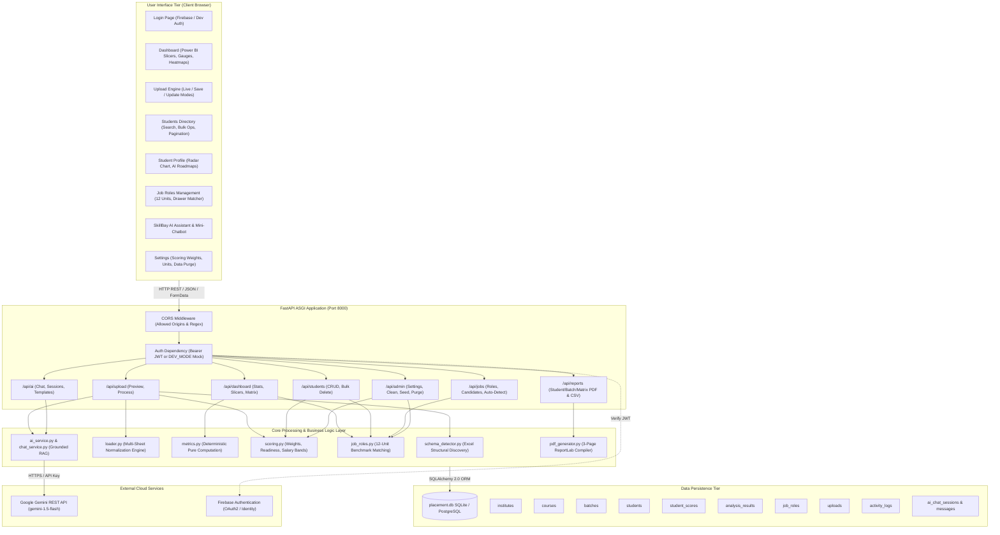
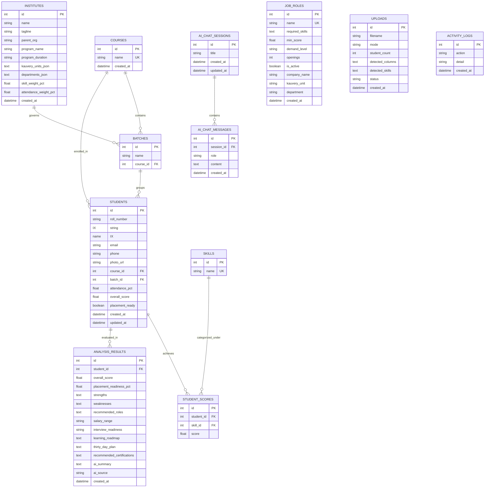
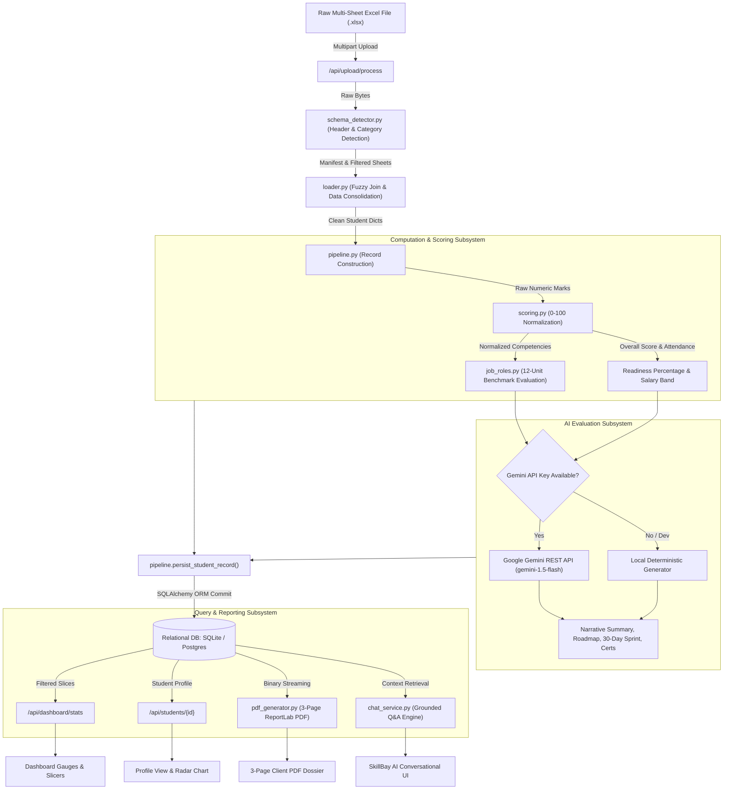

# Technical Project Analysis & Architectural Audit Report

**Project Title:** AI Placement Dashboard & Career Analytics Platform  
**Sub-Initiative:** Skill Bay Academy — Kauvery Hospital Career & Competency Development Program (CCDP)  
**Project Type:** Full-Stack Enterprise Web Application & AI-Powered Placement Analytics Engine  
**Prepared By:** Principal Software Architect, Full-Stack Systems Engineer & Technical Documentation Specialist  
**Evaluation Date:** October 2026  
**Document Version:** 2.0.0 (Production Architecture Audit)  
**Classification:** Confidential — Internal Technical Evaluation  

---

## TABLE OF CONTENTS

- [Cover Page](#cover-page)
- [1. Executive Summary](#1-executive-summary)
- [2. Project Introduction](#2-project-introduction)
  - [2.1 Background](#21-background)
  - [2.2 Problem Statement](#22-problem-statement)
  - [2.3 Proposed Solution](#23-proposed-solution)
  - [2.4 Purpose of the Project](#24-purpose-of-the-project)
  - [2.5 Target Users & Stakeholders](#25-target-users--stakeholders)
- [3. Project Objectives](#3-project-objectives)
  - [3.1 Primary Objectives](#31-primary-objectives)
  - [3.2 Secondary Objectives](#32-secondary-objectives)
- [4. System Overview](#4-system-overview)
  - [4.1 Overall System Architecture](#41-overall-system-architecture)
  - [4.2 Core Functional Modules](#42-core-functional-modules)
  - [4.3 High-Level User Flow](#43-high-level-user-flow)
- [5. Technology Stack](#5-technology-stack)
- [6. System Architecture](#6-system-architecture)
  - [6.1 Architectural Topology](#61-architectural-topology)
  - [6.2 End-to-End Architecture Diagram](#62-end-to-end-architecture-diagram)
  - [6.3 Decoupled Subsystems & Communication Channels](#63-decoupled-subsystems--communication-channels)
- [7. Project Directory & File Structure](#7-project-directory--file-structure)
- [8. Functional Module Analysis](#8-functional-module-analysis)
  - [8.1 Multi-Sheet Ingestion & Schema Detector Engine](#81-multi-sheet-ingestion--schema-detector-engine)
  - [8.2 Data Cleaning & Normalization Pipeline](#82-data-cleaning--normalization-pipeline)
  - [8.3 Deterministic Scoring & Readiness Engine](#83-deterministic-scoring--readiness-engine)
  - [8.4 Algorithmic Job-Role Matching Engine](#84-algorithmic-job-role-matching-engine)
  - [8.5 Hybrid AI Intelligence & RAG Chat Service](#85-hybrid-ai-intelligence--rag-chat-service)
  - [8.6 Power BI Dashboard & Multi-Slicer Analytics](#86-power-bi-dashboard--multi-slicer-analytics)
  - [8.7 Multi-Tier Reporting & Document Generation](#87-multi-tier-reporting--document-generation)
  - [8.8 Institutional Administration & Governance Module](#88-institutional-administration--governance-module)
- [9. Frontend Architecture Analysis](#9-frontend-architecture-analysis)
  - [9.1 Component Hierarchy & Layout Tree](#91-component-hierarchy--layout-tree)
  - [9.2 Page Implementations](#92-page-implementations)
  - [9.3 State Management & Server Synchronization](#93-state-management--server-synchronization)
  - [9.4 UI/UX Design System & Dynamic Theming](#94-uiux-design-system--dynamic-theming)
  - [9.5 Error, Loading & Boundary States](#95-error-loading--boundary-states)
- [10. Backend Architecture Analysis](#10-backend-architecture-analysis)
  - [10.1 Server Framework & ASGI Setup](#101-server-framework--asgi-setup)
  - [10.2 Router Subsystem & API Controllers](#102-router-subsystem--api-controllers)
  - [10.3 Service Layer Pattern](#103-service-layer-pattern)
  - [10.4 Middleware Pipeline](#104-middleware-pipeline)
  - [10.5 Startup Automation & Schema Self-Migration](#105-startup-automation--schema-self-migration)
- [11. Database Architecture & Data Models](#11-database-architecture--data-models)
  - [11.1 Persistence Strategy](#111-persistence-strategy)
  - [11.2 Entity-Relationship (ER) Schema Diagram](#112-entity-relationship-er-schema-diagram)
  - [11.3 Table Definitions & Fields](#113-table-definitions--fields)
  - [11.4 Indexing & Query Optimizations](#114-indexing--query-optimizations)
- [12. API Endpoint Analysis](#12-api-endpoint-analysis)
- [13. Authentication & Authorization Analysis](#13-authentication--authorization-analysis)
  - [13.1 Hybrid Auth Design](#131-hybrid-auth-design)
  - [13.2 Session & Token Lifecycle](#132-session--token-lifecycle)
  - [13.3 Route Protection & Role RBAC Gaps](#133-route-protection--role-rbac-gaps)
- [14. Security Analysis & Vulnerability Audit](#14-security-analysis--vulnerability-audit)
  - [14.1 Detailed Threat Matrix](#141-detailed-threat-matrix)
  - [14.2 Code Evidence & Vulnerability Assessment](#142-code-evidence--vulnerability-assessment)
  - [14.3 Recommended Security Remediations](#143-recommended-security-remediations)
- [15. Performance & Scalability Analysis](#15-performance--scalability-analysis)
- [16. Code Quality & Structural Maintainability](#16-code-quality--structural-maintainability)
- [17. Testing & Verification Analysis](#17-testing--verification-analysis)
- [18. Deployment & Infrastructure Analysis](#18-deployment--infrastructure-analysis)
- [19. User Workflow Journey](#19-user-workflow-journey)
- [20. End-to-End Data Flow Architecture](#20-end-to-end-data-flow-architecture)
- [21. Implemented Features Matrix](#21-implemented-features-matrix)
- [22. Bugs, Code Defects & Inconsistencies](#22-bugs-code-defects--inconsistencies)
- [23. Improvement Recommendations](#23-improvement-recommendations)
- [24. Future Roadmap & Strategic Enhancements](#24-future-roadmap--strategic-enhancements)
- [25. Project Technical Strengths](#25-project-technical-strengths)
- [26. Architectural Limitations](#26-architectural-limitations)
- [27. Architectural Conclusion](#27-architectural-conclusion)
- [28. Appendix](#28-appendix)

---

## 1. EXECUTIVE SUMMARY

The **Skill Bay Academy — AI Placement Dashboard & Career Analytics Platform** is an enterprise-grade full-stack solution engineered to automate student competency assessment, job-role eligibility matching, institutional placement intelligence, and narrative career roadmap generation. Developed primarily for Skill Bay Academy (an educational initiative operating in partnership with **Kauvery Hospital**), the system ingests student tracking datasets from multi-sheet Excel/CSV files, processes attendance and multi-dimensional assessment metrics, evaluates readiness against 12 Kauvery Hospital operational units and external healthcare partner profiles, and produces boardroom-ready analytics alongside individualized 3-page Canva-style PDF reports.

This technical report delivers an exhaustive, source-code verified architectural audit of the entire codebase. The application is built upon a modern, decoupled stack comprising a **FastAPI** ASGI backend running in Python 3.11+, an **SQLAlchemy 2.0** ORM layer supporting SQLite and PostgreSQL, and a **React 19** Single-Page Application (SPA) bundled via **Vite 5** and styled with **Tailwind CSS v3**. Real-time business intelligence is powered by **Recharts**, while generative career analysis is fulfilled by a hybrid engine utilizing **Google Gemini AI** (`gemini-1.5-flash` / `gemini-1.5-pro`) with deterministic local fallbacks.

### Key Audit Findings:
1. **Core Processing Engine Quality:** The system features advanced automated Excel parsing (`schema_detector.py` and `loader.py`), which successfully handles multi-row merged headers, fuzzy candidate matching across disparate sheets (e.g. Assessment, Skill Matrix, Attendance, Placement, and Uniform), and eliminates non-skill administrative data from evaluation scoring.
2. **Dual AI Operating Modes:** The architecture guarantees complete operational continuity via a dual-mode implementation. When a Gemini API key is absent or network access is restricted, the platform executes deterministic, mathematically grounded local heuristic generation for roadmaps, 30-day preparation plans, and Q&A chat responses without synthetic hallucination.
3. **Power BI-Grade Visualizations:** The frontend features an interactive command center equipped with multi-slicers (Batch, Course, Performance Tier, Readiness), live SVG gauges, radar competency charts, skill gap heatmaps, and a hospital unit fulfillment matrix.
4. **Defects & Vulnerabilities Identified:** The audit revealed critical runtime bugs (e.g., an unimported function causing an uncaught `NameError` on `/api/jobs/roles/auto-detect`), security vulnerabilities including unbounded file uploads in memory, client-side HTML injections via unescaped markdown rendering, CSV formula injection risks, and an insecure `DEV_MODE=True` authentication bypass that disables token verification.

Overall, the project represents a mature, functionally rich MVP that exceeds conventional prototype standards and is primed for enterprise production rollout following targeted remediation of identified security and exception-handling gaps.

---

## 2. PROJECT INTRODUCTION

### 2.1 Background
Skill Bay Academy runs specialized vocational training programs, notably the **Career & Competency Development Program (CCDP)** spanning intensive 50-day cohorts. Students are trained across technical healthcare skills, hospital information systems (HIS/EMR), medical billing, insurance processes, customer experience, and soft skills. Historically, student evaluations, attendance logs, and job matching were managed through disparate, unstructured spreadsheets containing heterogeneous formatting, merged headers, and inconsistently mapped assessment scores.

### 2.2 Problem Statement
Manual processing of cohort spreadsheets created severe operational friction:
- **Data Inconsistency:** Excel workbooks contained varying sheet structures, misaligned student names across tabs, merged header cells, and non-academic data (such as uniform sizing and parental phone numbers) inadvertently mixed with performance marks.
- **Latency in Evaluation:** Calculating individual weighted performance scores (75% skill competencies, 25% attendance) and predicting role suitability for dozens of students required days of administrative labor.
- **Subjective Matching:** Placement officers lacked a standardized, objective rubric to evaluate student readiness against the distinct requisites of Kauvery Hospital's 12 regional hospital units and departments.
- **Lack of Actionable Feedback:** Students received basic report cards without structured 30-day remediation plans, identified competency gaps, or targeted certification roadmaps.

### 2.3 Proposed Solution
The AI Placement Dashboard provides an end-to-end automated platform that:
- Ingests raw, multi-sheet workbooks through an intelligent schema detection algorithm.
- Standardizes scores against benchmark criteria (converting 10-point, 25-point, and 50-point scales to a uniform 100-point normalized scale).
- Applies an algorithmic rule engine to match candidates with active healthcare job roles across 12 Kauvery Hospital units into four fit tiers (*Perfect Match*, *Medium Fit*, *Low Fit*, *Not Eligible*).
- Synthesizes personalized narratives and study plans using Google Gemini generative AI.
- Renders pixel-accurate, multi-page PDF performance reports for students, placement cells, and corporate recruiters.
- Exposes a conversational AI assistant for conversational natural-language cohort querying grounded directly in verified student records.

### 2.4 Purpose of the Project
The primary objective of the platform is to bridge institutional training outcomes with corporate healthcare hiring requirements by digitizing evaluation, predicting job fitness with algorithmic objectivity, and providing administrators with high-density visual intelligence.

### 2.5 Target Users & Stakeholders
1. **Academy Administrators & Directors:** Oversee cohort progress, benchmark trainers, track placement ratios, and configure institutional scoring parameters.
2. **Placement Officers & Recruiters:** Query top-fit candidates for specific hospital openings, evaluate unit fulfillment rates, and export batch dossiers.
3. **Trainers & Faculty:** Identify weak competency clusters via heatmaps to conduct targeted remedial workshops.
4. **CCDP Students:** Receive comprehensive 3-page personalized PDF reports detailing their class rank, skill radar, interview readiness, and personalized 30-day preparation sprint.

---

## 3. PROJECT OBJECTIVES

### 3.1 Primary Objectives
- **Automated Ingestion Pipeline:** Implement robust parser capabilities to ingest multi-sheet Excel files without requiring rigid column templates or manual cell restructuring.
- **Standardized Multi-Factor Scoring:** Implement an absolute-scale scoring engine blending normalized skill competencies (default 75%) and attendance track records (default 25%).
- **Multi-Unit Hospital Role Matching:** Map student competencies to discrete hospital operational roles across 12 Kauvery units, factoring in hard score floors and mandatory skill thresholds.
- **Automated Document Generation:** Generate standardized, printable 3-page student PDF reports and batch-level audit matrices mirroring executive graphic design benchmarks.
- **Grounded Conversational Intelligence:** Provide a conversational interface capable of retrieving cohort statistics, salary summaries, and student portfolios without LLM hallucination.

### 3.2 Secondary Objectives
- Enable dynamic Power BI style multi-slicer filtering across batch cohorts, departments, and performance tiers without page reloads.
- Provide a persistent administrative configuration module to customize institutional metadata, scoring weights, and unit taxonomies.
- Maintain a local, offline execution mode requiring zero third-party cloud API keys or cloud dependencies for local sandboxed deployments.

---

## 4. SYSTEM OVERVIEW

### 4.1 Overall System Explanation
The system operates as a decoupled client-server architecture. The frontend application provides a reactive dashboard interface built on React 19. When an administrator uploads an Excel workbook, the backend ASGI application (`FastAPI`) receives the binary stream, initiates a schema classification scan, normalizes candidate records across all sheets, executes deterministic scoring, queries active job requirements, synthesizes AI evaluations, and saves the cohort into an SQL database (`SQLite` in local development, extensible to `PostgreSQL`).

### 4.2 Major Modules
1. **Schema Detector & Workbook Ingestion:** Scans Excel structures, detects header offsets, filters uniform/personal noise, and unifies student rosters.
2. **Scoring Engine & Placement Evaluator:** Computes absolute normalized scores, attendance percentages, class rankings, and salary band projections.
3. **Job Roles & Unit Placement Matrix:** Manages role criteria, department requisites, open vacancies, and executes multi-criteria candidate matching.
4. **AI Narrative Generator & Grounded Chatbot:** Integrates Google Gemini API with retrieval-grounded fallback logic to produce summaries and answer data queries.
5. **PDF & Document Rendering Subsystem:** Compiles ReportLab documents into visual, publication-quality PDF dossiers.
6. **Administrative Governance Center:** Exposes institutional settings, data purge routines, legacy skill cleanup, and notification tracking.

### 4.3 High-Level User Flow



---

## 5. TECHNOLOGY STACK

The table below details all core technologies, their explicit purpose, and their location in the codebase:

| Category | Technology | Version | Purpose in Project | Implementation Location |
| :--- | :--- | :--- | :--- | :--- |
| **Frontend Framework** | React | `19.0.0` | Declarative UI rendering, reactive component lifecycle, DOM reconciliation | `frontend/src/` |
| **Build & Tooling** | Vite | `5.4.8` | Ultra-fast HMR dev server and Rollup-based production bundler | `frontend/vite.config.js` |
| **Styling Engine** | Tailwind CSS | `3.4.13` | Utility-first responsive styling, custom brand tokens, dark mode classes | `frontend/tailwind.config.js`, `frontend/src/index.css` |
| **Client State / Cache** | TanStack React Query | `5.59.0` | Server-state caching, optimistic updates, background refetching, query invalidation | `frontend/src/main.jsx`, all pages |
| **Routing** | React Router DOM | `6.26.2` | Client-side routing, protected route guards, URL parameter extraction | `frontend/src/App.jsx` |
| **Data Visualization** | Recharts | `2.12.7` | Responsive SVG charts (Bar, Line, Area, Radar, Sliced distribution) | `frontend/src/pages/DashboardOverview.jsx`, `StudentProfile.jsx` |
| **Icons** | Lucide React | `0.446.0` | Modern SVG iconography across UI components and navigation | `frontend/src/components/`, `frontend/src/pages/` |
| **HTTP Client** | Axios | `1.7.7` | Client-side API requests with bearer-token authorization interceptors | `frontend/src/lib/api.js` |
| **Authentication (Client)** | Firebase JS SDK | `10.14.0` | Client-side Google OAuth popup and Email/Password authentication | `frontend/src/lib/firebase.js`, `frontend/src/context/AuthContext.jsx` |
| **Backend Framework** | FastAPI | `0.115.0` | High-performance Python ASGI web framework with automatic OpenAPI docs | `backend/app/main.py` |
| **ASGI Server** | Uvicorn | `0.30.6` | Lightning-fast ASGI web server implementation | `backend/run.py` |
| **Database ORM** | SQLAlchemy | `2.0.35` | Object-Relational Mapping, relational modeling, transaction management | `backend/app/database.py`, `backend/app/models.py` |
| **Validation / Settings** | Pydantic & Pydantic-Settings | `2.9.2` / `2.5.2` | Data parsing, schema validation, and `.env` environment loading | `backend/app/schemas.py`, `backend/app/config.py` |
| **Data Analysis** | Pandas & NumPy | `2.2.3` / `1.26.4` | Matrix computations, series manipulation, Excel sheet parsing | `backend/app/services/upload_processing.py`, `backend/loader.py` |
| **Excel Ingestion** | OpenPyXL | `3.1.5` | Low-level Excel workbook cell extraction, merged cell inspection | `backend/schema_detector.py`, `backend/loader.py` |
| **Document Generation** | ReportLab | `4.2.5` | Programmable PDF generation (Flowables, Tables, NumberedCanvas, PageBreak) | `backend/pdf_generator.py`, `backend/app/routers/reports.py` |
| **Server Plotting** | Matplotlib | `3.9.x` (via venv) | Server-side rendering of radar and bar charts for ReportLab PDF embedding | `backend/pdf_generator.py` |
| **Async HTTP Client** | HTTPX | `0.27.2` | Asynchronous REST calls to Google Gemini Generative Language APIs | `backend/app/services/ai_service.py`, `backend/app/services/chat_service.py` |
| **AI Integration** | Google Gemini REST API | `v1beta` | LLM narrative report generation and grounded conversational responses | `backend/app/services/ai_service.py`, `backend/app/services/chat_service.py` |
| **Authentication (Server)** | Firebase Admin SDK | `6.5.0` | Server-side verification of client Firebase JWT ID tokens | `backend/app/auth.py` |
| **Database Driver (SQL)** | SQLite3 / Psycopg2-binary | Built-in / `2.9.9` | Relational storage engine (SQLite local, PostgreSQL enterprise ready) | `backend/placement.db`, `backend/app/database.py` |

---

## 6. SYSTEM ARCHITECTURE

### 6.1 Architectural Topology
The application follows a modern N-Tier decoupled client-server architecture:
1. **Presentation Tier (SPA):** Static SPA hosted on Vite/Vercel communicating exclusively via REST JSON endpoints.
2. **API & Orchestration Tier (FastAPI):** Exposes modular routers under `/api/*`, protected by authentication middleware and dependency injection.
3. **Business Logic & Service Layer:** Decoupled functional domain services executing scoring, Excel parsing, matching, and PDF composition.
4. **Persistence Tier:** Relational SQL schema with foreign keys, cascading deletions, and programmatic table auto-migrations.
5. **External Integration Tier:** Google Gemini API for generative narrative extraction and Firebase for federated identity verification.

### 6.2 End-to-End Architecture Diagram



---

## 7. PROJECT DIRECTORY & FILE STRUCTURE

The repository is organized cleanly into backend and frontend workspaces. The table below documents every non-generated file and its distinct purpose:

| File / Folder Path | Type | Functional Purpose | Architectural Significance |
| :--- | :--- | :--- | :--- |
| `README.md` | Doc | Root quickstart guide, setup instructions, brand guidelines | Entry point for development and local execution |
| `project_structure.txt` | Doc | Initial tree layout reference of files | Historical file organization baseline |
| `step0_request.txt` | Spec | Technical specification for schema detection, metrics, and report layout | Architectural specification driving the data layer |
| `package.json` | Config | Root monorepo scripts for running concurrent services | Executes `run_backend.bat` and `run_frontend.bat` |
| `vercel.json` | Config | Vercel deployment routing configuration | Rewrites `/api/(.*)` to backend and `/(.*)` to frontend |
| `run_backend.bat` | Script | Windows batch script to launch Uvicorn backend | Developer workflow automation |
| `run_frontend.bat` | Script | Windows batch script to launch Vite dev server | Developer workflow automation |
| `sample_students.csv` | Fixture | Sample 5-student CSV for ingestion validation | Used in regression tests |
| `Students Complete Details - CCDP 2(1).xlsx` | Fixture | Live production multi-sheet workbook of CCDP 2 cohort | Primary source file containing 30 student records |
| `backend/` | Directory | FastAPI ASGI Python Application root | Houses database, routers, services, and tests |
| `backend/app/main.py` | Code | ASGI application initialization, CORS, routers, startup self-migrations | Core server entry point |
| `backend/app/config.py` | Code | Pydantic Settings reading environment variables | Centralized settings management |
| `backend/app/database.py` | Code | SQLAlchemy engine setup, sessionmaker, schema self-migration | DB connection pool and auto-migration hooks |
| `backend/app/models.py` | Code | SQLAlchemy ORM entity models for all 10 database tables | Canonical schema definition |
| `backend/app/schemas.py` | Code | Pydantic DTO output schemas for endpoint serializations | Type safety and response serialization |
| `backend/app/auth.py` | Code | Firebase Admin token verification with `DEV_MODE` fallback | Security gateway for protected endpoints |
| `backend/app/routers/` | Directory | REST API controllers modularized by functional domain | Exposes endpoints for admin, AI, auth, dash, jobs, reports, students, upload |
| `backend/app/services/` | Directory | Decoupled business logic implementations | Ingestion, pipeline, scoring, role matching, AI narrative synthesis |
| `backend/schema_detector.py` | Code | Generic heuristic and statistical scanner for uploaded Excel workbooks | Discovers headers, 2-row merged cells, and classifies sheet categories |
| `backend/loader.py` | Code | Multi-sheet data consolidation engine | Resolves name variations, computes attendance, filters uniform noise |
| `backend/metrics.py` | Code | Pure computational mathematics layer | Derives rankings, percentiles, subject averages, and typing statistics |
| `backend/pdf_generator.py` | Code | 3-page pixel-accurate ReportLab PDF rendering engine | Compiles publication-grade student performance reports |
| `backend/import_ccdp2.py` | Script | CLI script to seed CCDP 2 cohort into the database | Automates initial data population |
| `backend/migrate.py` | Script | Database migration script adding dynamic institute settings columns | Handles SQLite schema updates |
| `backend/test_all_endpoints.py`| Test | Comprehensive FastAPI TestClient regression test suite | Verifies uploads, dashboard stats, jobs, chat, and reports |
| `backend/test_live_system.py` | Test | Live socket test against running localhost:8000 and localhost:5173 | Verifies full integration across running services |
| `backend/test_pdf_report.py` | Test | Generates test PDFs for top student and unplaced student | Validates ReportLab output formatting |
| `frontend/` | Directory | React 19 + Vite 5 Single Page Application | Modern responsive frontend UI |
| `frontend/src/main.jsx` | Code | React DOM entry point, TanStack QueryClient, Context providers | React application bootstrap |
| `frontend/src/App.jsx` | Code | React Router DOM declaration with ProtectedRoute guards | Client-side routing configuration |
| `frontend/src/index.css` | Style | Tailwind CSS directives and custom Skill Bay brand color tokens | Global stylesheet |
| `frontend/src/lib/api.js` | Code | Axios instance with Bearer token request interceptor | Centralized HTTP client |
| `frontend/src/lib/firebase.js` | Code | Firebase Client SDK initialization with DEV_MODE guard | Identity provider configuration |
| `frontend/src/context/` | Directory | React Context providers (AuthContext and ThemeContext) | Global state for auth sessions and light/dark theme |
| `frontend/src/components/` | Directory | Layout, Sidebar, Topbar, MiniChatbot, ProtectedRoute | Global layout scaffolding |
| `frontend/src/components/ui/`| Directory | Atomic UI widgets: Card, Button, Badge, PowerBiKpiCard, PowerBiGauge | Design system component library |
| `frontend/src/pages/` | Directory | 8 primary page views (DashboardOverview, StudentsDirectory, StudentProfile, UploadStudentData, JobRoles, SkillBayAI, Settings, Login) | Core application view screens |

---

## 8. FUNCTIONAL MODULE ANALYSIS

### 8.1 Multi-Sheet Ingestion & Schema Detector Engine
- **Purpose:** Ingest arbitrary institutional Excel workbooks without hardcoded cell positions or sheet names.
- **Files Involved:** `backend/schema_detector.py`, `backend/loader.py`, `backend/app/services/upload_processing.py`.
- **Workflow:**
  1. OpenPyXL opens the uploaded file stream.
  2. Scans the first 15 rows of each sheet to locate the true header row (identifying where text columns become populated and numeric/data rows begin).
  3. Detects 2-row merged header patterns (Row 1 = Subject Name, Row 2 = Max Marks / Out of X) and merges them into unified canonical names.
  4. Classifies sheet categories: `profile/roster`, `attendance`, `assessment/scores`, `skill matrix`, `placement`, `other skills`, and `irrelevant` (e.g. Uniform sizing).
  5. Applies strict regex patterns (`NON_SKILL_PATTERNS`) to purge phone numbers, Aadhar numbers, parental contacts, age, and serial numbers.
- **Important Functions:**
  - `schema_detector.py` -> `detect_workbook_schema()`: Orchestrates sheet-by-sheet inspection.
  - `upload_processing.py` -> `extract_skill_meta()`: Strips scale annotations (`Communication Out of 10` -> `Communication Skills`, scale=10).
  - `upload_processing.py` -> `_detect_phone_or_id_column()`: Checks if numerical values exceed 1000 or have 7+ digits to eliminate phone numbers from skill scores.
- **Potential Issues:** If an uploaded workbook contains entirely unconventional headers without recognized keywords and `GEMINI_API_KEY` is not provided, fallback heuristics may default unclassified columns to metadata rather than skills.

### 8.2 Data Cleaning & Normalization Pipeline
- **Purpose:** Join heterogeneous student entries across sheets where spelling varies slightly (e.g. "Madhumitha K" vs "Mathumitha K").
- **Files Involved:** `backend/loader.py`, `backend/app/services/pipeline.py`.
- **Workflow:**
  1. Uses the Profile/Roster sheet as the ground truth canonical roster.
  2. For secondary sheets (Attendance, Assessment, Skill Matrix), applies fuzzy string matching (`SequenceMatcher`, threshold=0.82) alongside a per-sample dictionary (`KNOWN_NAME_FIXES`) to correlate records.
  3. Parses attendance cells counting `P`/`A` marks across daily columns, computing `present_days / total_trackable_days * 100`.
  4. Normalizes placement salary strings (e.g. `Rs. 18,000`, `18000`, `₹18,000/pm`) into a standardized display format: `Rs. 18,000 / month`.
- **Important Functions:**
  - `loader.py` -> `_fuzzy_join_name()`: Reconciles misspellings across sheets.
  - `loader.py` -> `validate_students()`: Enforces assertions ensuring exactly expected student counts and zero unhandled duplicate records.

### 8.3 Deterministic Scoring & Readiness Engine
- **Purpose:** Compute objective, transparent student performance metrics without grading curve distortion.
- **Files Involved:** `backend/app/services/scoring.py`, `backend/metrics.py`.
- **Mathematical Formulations:**
  - **Normalized Skill Score ($S_{norm}$):**
    $$S_{norm} = \min\left(\max\left(\frac{\text{Raw Score}}{\text{Max Scale}} \times 100, 0\right), 100\right)$$
  - **Overall Performance Score ($O$):**
    $$O = (\text{Mean}(S_{norm}) \times W_{skill}) + (\text{Attendance \%} \times W_{att})$$
    *(Default institutional weights: $W_{skill} = 0.75$, $W_{att} = 0.25$)*
  - **Placement Readiness Percentage ($R$):**
    $$R = (O \times 0.55) + (\text{Attendance \%} \times 0.15) + (\text{Top Role Confidence} \times 0.30)$$
  - **Readiness Classification:** Candidate is designated *Placement Ready* if $R \ge 55.0\%$.
- **Salary Band Modeling:**
  - $\ge 85\%$: ₹4.5–7.0 LPA
  - $\ge 70\%$: ₹3.5–5.0 LPA
  - $\ge 55\%$: ₹2.8–3.8 LPA
  - $\ge 40\%$: ₹2.2–2.8 LPA
  - $< 40\%$: ₹1.8–2.4 LPA

### 8.4 Algorithmic Job-Role Matching Engine
- **Purpose:** Match student competencies to active hospital operational roles across 12 Kauvery Hospital branches.
- **Files Involved:** `backend/app/services/job_roles.py`, `backend/app/routers/jobs.py`.
- **Workflow:**
  1. Queries active job roles stored in `job_roles` table.
  2. For each role, parses required skill criteria (e.g., *Communication Skills* min 18/25, *Soft Skills* min 16/25).
  3. Evaluates student scores against each criterion using fuzzy synonym matching (`_skill_match`).
  4. Calculates criteria percentage achieved vs total required benchmarks.
  5. Computes composite confidence:
     $$\text{Confidence} = (\text{Criteria \%} \times 0.65) + (\text{Overall Score} \times 0.25) + 10.0$$
  6. Categorizes candidate into fit tiers:
     - **Perfect Match:** $\ge 75\%$
     - **Medium Fit:** $55\% - 74\%$
     - **Low Fit:** $35\% - 54\%$
     - **Not Eligible:** $< 35\%$
- **Important Functions:**
  - `job_roles.py` -> `match_job_roles()`: Computes top matching roles for a given student.
  - `job_roles.py` -> `get_role_candidates()`: Computes candidate shortlist for a specific role drawer.

### 8.5 Hybrid AI Intelligence & RAG Chat Service
- **Purpose:** Synthesize qualitative career recommendations and answer natural language administrator queries.
- **Files Involved:** `backend/app/services/ai_service.py`, `backend/app/services/chat_service.py`, `backend/app/routers/ai.py`.
- **Workflow:**
  - **Narrative Generation:** When Gemini API is configured, submits structured student strengths, weaknesses, and matched roles to `gemini-1.5-flash` with strict JSON instructions. If offline or unconfigured, triggers `generate_local_report()`, building deterministic, mathematically sound roadmaps and 30-day preparation sprints.
  - **Grounded Q&A (RAG):** Caches the live metrics bundle in memory. When a query is received (e.g., *"Which candidates are unplaced?"* or *"Who scored highest in Typing?"*), `retrieve_grounded_slice()` extracts only the matching JSON slice. If Gemini is available, sends this slice with system instructions forbidding hallucination; otherwise, executes `answer_from_slice()` producing instant, formatted markdown responses.

### 8.6 Power BI Dashboard & Multi-Slicer Analytics
- **Purpose:** Provide an interactive executive dashboard with instant slicing across cohorts, departments, and readiness tiers.
- **Files Involved:** `backend/app/routers/dashboard.py`, `frontend/src/pages/DashboardOverview.jsx`, `frontend/src/components/ui/PowerBiKpiCard.jsx`, `frontend/src/components/ui/PowerBiGauge.jsx`.
- **Features:**
  - **Dynamic Multi-Slicers:** Slicing by Batch, Course, Performance Tier (Tier 1 $\ge 80\%$, Tier 2 $60-79\%$, Tier 3 $40-59\%$, Tier 4 $<40\%$), and Placement Readiness.
  - **SVG Speedometer Gauges:** Real-time visual comparison of actual Placement Readiness and Attendance vs target benchmarks (80% and 85%).
  - **Kauvery Unit Fulfillment Matrix:** Real-time tracking of 12 hospital branches, department openings, matched candidate counts, and fulfillment percentages.
  - **Interactive Competency Radar:** Recharts Polar Radar plotting cohort skill averages against institutional benchmarks.

### 8.7 Multi-Tier Reporting & Document Generation
- **Purpose:** Generate client-facing, printable PDF and CSV exports for students, recruiters, and executive leadership.
- **Files Involved:** `backend/pdf_generator.py`, `backend/app/routers/reports.py`.
- **Export Capabilities:**
  1. **Individual Student Report (PDF):** A 3-page Canva-style document containing identity grid, KPI stat cards, attendance donut chart, typing speed range bar, subject assessment breakdown, competency radar chart, placement status badge, and AI career roadmap.
  2. **Batch Summary (PDF & CSV):** Consolidated roster with student scores, attendance, status, and best-fit roles.
  3. **Role Match Matrix (PDF & CSV):** Landscape cross-tabulation matrix mapping students against active roles with color-coded fit tiers.
  4. **Full Institute Placement Audit (PDF):** Strategic institutional audit detailing course comparisons, weak skill heatmaps, and opening fulfillment rates.

### 8.8 Institutional Administration & Governance Module
- **Purpose:** Provide administrative controls over scoring formulas, institutional branding, unit structures, and database hygiene.
- **Files Involved:** `backend/app/routers/admin.py`, `frontend/src/pages/Settings.jsx`.
- **Features:**
  - Real-time modification of Academy Name, Parent Organization, Program Name, and Program Duration.
  - Interactive rebalancing of Skill Weight vs Attendance Weight (enforcing a strict 100% sum validation).
  - Editable lists for Kauvery Hospital Units and Clinical Departments stored as JSON arrays.
  - Database sanitation utilities: Clean Legacy Non-Skills, Seed Default Roles, Clean Test Data, and Full Reset.

---

## 9. FRONTEND ANALYSIS

### 9.1 Component Hierarchy & Layout Tree

```
App.jsx (React Router DOM)
├── /login -> Login.jsx
└── ProtectedRoute
    └── Layout.jsx
        ├── Sidebar.jsx (Navigation, Brand, Theme Switcher, Logout)
        ├── Topbar.jsx (Title, Global Search, Dark/Light Toggle, Notification Bell, User Avatar)
        ├── MiniChatbot.jsx (Floating AI Assistant Widget)
        └── Page Views:
            ├── / -> DashboardOverview.jsx
            ├── /upload -> UploadStudentData.jsx
            ├── /students -> StudentsDirectory.jsx
            ├── /students/:id -> StudentProfile.jsx
            ├── /jobs -> JobRoles.jsx
            ├── /ai-assistant -> SkillBayAI.jsx
            └── /settings -> Settings.jsx
```

### 9.2 Page Implementations
- **`DashboardOverview.jsx` (1,117 LOC):** The analytical heart of the application. Features tabbed views (*Executive Overview*, *Hospital Unit Matrix*, *Candidate Roster Grid*), dynamic multi-slicers, KPI metric cards, SVG gauges, radar charts, and export modal triggers.
- **`StudentsDirectory.jsx` (578 LOC):** Searchable, paginated student roster with sorting by name, score, attendance, or updated date. Supports multi-student checkbox selection, bulk deletion, and filtered CSV export.
- **`StudentProfile.jsx` (308 LOC):** Detailed individual profile displaying attendance metrics, student score badges, Recharts polar radar chart, predicted salary band, interview readiness tag, and AI-generated narrative roadmap.
- **`UploadStudentData.jsx` (644 LOC):** Drag-and-drop file ingestion interface supporting `.xlsx`, `.xls`, and `.csv`. Displays a comprehensive pre-upload preview detailing detected skills, excluded non-skill columns, sheet summaries, and warnings. Supports three modes: *Live Preview*, *Save & Analyze*, and *Update Existing Batch*.
- **`JobRoles.jsx` (685 LOC):** Interactive role management center. Lists active job openings with department badges, demand levels, and skill criteria tags. Includes a slide-out drawer (`CandidatesDrawer`) displaying matched candidates categorized into *Perfect Match*, *Medium Fit*, and *Low Fit*.
- **`SkillBayAI.jsx` (531 LOC):** Dedicated conversational intelligence console featuring persistent chat session history, one-click prompt templates (*Batch Audit*, *Top Candidates*, *Skill Gaps*, *Interview Prep*), model selector dropdown, and markdown response rendering with copy-to-clipboard actions.
- **`Settings.jsx` (848 LOC):** Comprehensive administration center with tabs for *General Settings*, *Hospital Units & Roles*, *Scoring Weights*, and *Data Management*.
- **`Login.jsx` (123 LOC):** Branded sign-in portal supporting Google OAuth and Email/Password credentials.

### 9.3 State Management & Server Synchronization
The frontend avoids heavy global state libraries (like Redux or Zustand) in favor of **TanStack React Query v5**, creating an efficient server-state architecture:
- Automatic background refetching and window focus caching policies.
- Optimistic cache invalidations upon mutation (e.g. invalidating `["students"]`, `["dashboard-stats"]`, and `["batches"]` immediately following student deletion or batch upload).
- Lightweight React Contexts handle client-only concerns:
  - `AuthContext`: Tracks authenticated user profile and provides login/logout wrappers.
  - `ThemeContext`: Toggles `dark` class on the root HTML element and persists state in `localStorage`.

### 9.4 UI/UX Design System & Dynamic Theming
The design system reflects the branding of Skill Bay Academy and Kauvery Hospital:
- **Brand Tokens:**
  - Maroon (`#8B1D55`): Primary actions, active nav states, brand highlights.
  - Purple (`#72398C`): Secondary accents, badges, and headers.
  - Pink (`#DE4F73`): Interactive highlights, focus rings, and positive deltas.
  - Yellow (`#EFBC19`): Warning states, moderate readiness tiers, and in-progress indicators.
- **Dark Mode Architecture:** Full dark mode support using Tailwind's `class` strategy. Surfaces utilize deep dark tones (`#17161A`, `#1E1D22`, `#26242B`) with border contrasts (`#34323A`) and muted typography (`#EDE9EE`, `#A6A1AC`).

### 9.5 Error, Loading & Boundary States
- Visual loading spinners (`Loader2` from Lucide) and skeletons are embedded in cards and table bodies during query resolution.
- Error alerts display HTTP error details from Axios response payloads.
- Empty states (`EmptyState` component) present contextual icons and instructions when datasets or search queries yield zero records.

---

## 10. BACKEND ANALYSIS

### 10.1 Server Architecture & ASGI Setup
The backend is powered by **FastAPI** (`0.115.0`) executed via **Uvicorn** on port 8000. It utilizes standard Python asynchronous coroutines (`async def`) for I/O bound endpoints (uploads, LLM API calls) and synchronous endpoints (`def`) for CPU-bound SQLAlchemy queries.

### 10.2 Router Subsystem & API Controllers
API routes are decoupled cleanly within `backend/app/routers/`:
1. `auth_router.py`: Profile identity resolution (`/api/auth/me`).
2. `admin.py`: Institutional settings, scoring weights, notifications, and data wipe routines.
3. `upload.py`: Multi-part stream ingestion, sheet preview, and pipeline execution.
4. `students.py`: Student listing with multi-field filtering, profile inspection, individual/bulk deletion, and patch updates.
5. `dashboard.py`: Multi-slicer dashboard statistics, gauge metrics, and unit matrix aggregations.
6. `jobs.py`: Role definitions, candidate matching drawers, and role toggle switches.
7. `reports.py`: Streaming binary PDF and CSV document responses.
8. `ai.py`: Stateless chat, session-persisted conversations, and prompt template providers.

### 10.3 Service Layer Pattern
Business logic is strictly separated from HTTP controllers into `backend/app/services/`:
- `upload_processing.py`: Header discovery, column filtering, and scale normalization.
- `pipeline.py`: Pure computational mapping of dataframes to domain records and database persistence.
- `scoring.py`: Mathematical normalization, readiness calculation, and salary prediction.
- `job_roles.py`: Benchmark criteria matching and fit tier categorization.
- `ai_service.py` & `chat_service.py`: LLM API calls, prompt templates, and grounded JSON slice retrieval.

### 10.4 Middleware Pipeline
- **CORS Middleware (`CORSMiddleware`):** Configured to permit requests from `http://localhost:5173`, `http://127.0.0.1:5173`, secondary dev ports, and regex pattern matching local loopback addresses (`r"http://(localhost|127\.0\.0\.1)(:\d+)?"`).
- **Authentication Dependency (`get_current_admin`):** Implemented as a FastAPI dependency injected across protected endpoints. Decodes Firebase ID tokens or bypasses checks when `DEV_MODE=True`.

### 10.5 Startup Automation & Schema Self-Migration
Upon startup (`@app.on_event("startup")` in `main.py`), the backend automatically:
1. Invokes `init_db()` to create any missing tables.
2. Inspects existing SQLite tables using PRAGMA checks and dynamically issues `ALTER TABLE` commands if columns like `company_name`, `openings`, `is_active`, `kauvery_unit`, `department`, `skill_weight_pct`, or `attendance_weight_pct` are absent.
3. Seeds the default `Institute` record if not present.
4. Pre-seeds default Kauvery Hospital job roles if the `job_roles` table is empty.

---

## 11. DATABASE ANALYSIS

### 11.1 Persistence Strategy
The database persistence layer is abstracted using **SQLAlchemy 2.0**. While the default configuration targets a local SQLite database (`placement.db`), the connection string can be swapped via `DATABASE_URL` in `.env` to connect to **PostgreSQL** or **Firebase Data Connect**.

### 11.2 Entity-Relationship (ER) Schema Diagram



### 11.3 Table Definitions & Fields

1. **`institutes`:** Stores administrative branding and global evaluation weights.
   - `id` (Integer, PK), `name` (String), `tagline` (String), `parent_org` (String), `program_name` (String), `program_duration` (String), `kauvery_units_json` (Text), `departments_json` (Text), `skill_weight_pct` (Float, default 75.0), `attendance_weight_pct` (Float, default 25.0), `created_at` (DateTime).
2. **`courses`:** Educational programs (e.g. CCDP).
   - `id` (Integer, PK), `name` (String, Unique), `created_at` (DateTime).
3. **`batches`:** Specific student cohorts under a course.
   - `id` (Integer, PK), `name` (String), `course_id` (Integer, FK -> `courses.id`).
4. **`skills`:** Canonical skill competencies (e.g. "Communication Skills", "MS Office & IT").
   - `id` (Integer, PK), `name` (String, Unique).
5. **`students`:** Master student profiles.
   - `id` (Integer, PK), `roll_number` (String, Indexed), `name` (String, Indexed), `email` (String), `phone` (String), `photo_url` (String, Nullable), `course_id` (Integer, FK), `batch_id` (Integer, FK), `attendance_pct` (Float), `overall_score` (Float), `placement_ready` (Boolean), `created_at` (DateTime), `updated_at` (DateTime).
6. **`student_scores`:** Normalized 0–100 scores per student per skill.
   - `id` (Integer, PK), `student_id` (Integer, FK -> `students.id`, Cascade Delete), `skill_id` (Integer, FK -> `skills.id`), `score` (Float).
7. **`analysis_results`:** AI-generated evaluations and role matches.
   - `id` (Integer, PK), `student_id` (Integer, FK -> `students.id`, Cascade Delete), `overall_score` (Float), `placement_readiness_pct` (Float), `strengths` (Text JSON), `weaknesses` (Text JSON), `recommended_roles` (Text JSON), `salary_range` (String), `interview_readiness` (String), `learning_roadmap` (Text), `thirty_day_plan` (Text), `recommended_certifications` (Text JSON), `ai_summary` (Text), `ai_source` (String), `created_at` (DateTime).
8. **`job_roles`:** Active hospital and partner job descriptions and benchmarks.
   - `id` (Integer, PK), `name` (String, Unique), `required_skills` (Text JSON criteria), `min_score` (Float), `demand_level` (String), `openings` (Integer), `is_active` (Boolean), `company_name` (String), `kauvery_unit` (String), `department` (String), `created_at` (DateTime).
9. **`uploads`:** Audit trail of ingested spreadsheets.
   - `id` (Integer, PK), `filename` (String), `mode` (String), `student_count` (Integer), `detected_columns` (Text JSON), `detected_skills` (Text JSON), `status` (String), `created_at` (DateTime).
10. **`activity_logs`:** System audit trail.
    - `id` (Integer, PK), `action` (String), `detail` (String), `created_at` (DateTime).
11. **`ai_chat_sessions` & `ai_chat_messages`:** Conversational memory.
    - Session: `id` (Integer, PK), `title` (String), `created_at`, `updated_at`.
    - Message: `id` (Integer, PK), `session_id` (Integer, FK), `role` (String), `content` (Text), `created_at`.

---

## 12. API ANALYSIS

The table below catalogs every endpoint implemented in the backend:

| HTTP Method | API Endpoint | Functional Purpose | Request Body / Parameters | Response Structure | Auth Required |
| :--- | :--- | :--- | :--- | :--- | :--- |
| `GET` | `/api/health` | Service health & metadata check | None | `{status, dev_mode, institute, parent_org, program}` | No |
| `GET` | `/api/auth/me` | Resolve current admin profile | None | `{uid, email, name}` | Yes (Bearer) |
| `GET` | `/api/admin/settings` | Fetch institutional settings | None | `{institute_name, tagline, parent_org, program_name, ...}` | No |
| `POST` | `/api/admin/settings` | Update institutional configuration | JSON `{institute_name, scoring weights, units, ...}` | `{message, status}` | No |
| `GET` | `/api/admin/notifications` | Fetch recent upload & activity alerts | None | `{notifications: [...], total: int}` | No |
| `POST` | `/api/admin/clean-legacy-skills` | Purge phone/ID columns from skills | None | `{message, deleted_skills, recalculated_students}` | No |
| `POST` | `/api/admin/seed-kauvery-roles` | Seed default Kauvery Hospital roles | None | `{message, seeded_count}` | No |
| `POST` | `/api/admin/clear-data` | Complete wipe of students and batches | None | `{message}` | No |
| `POST` | `/api/admin/clean-test-data` | Purge mock data while preserving CCDP 2 | None | `{message, deleted_students, deleted_batches}` | No |
| `POST` | `/api/upload/preview` | Dry-run upload inspection | Multipart `file` (`.xlsx`, `.xls`, `.csv`) | `{upload_id, student_count, detected_skills, warnings, ...}` | Yes (Bearer) |
| `POST` | `/api/upload/process` | Full ingestion & scoring pipeline | Multipart `file`, form: `mode, course_name, batch_name, overwrite` | `{mode, student_count, saved, skipped, batch, ...}` | Yes (Bearer) |
| `GET` | `/api/students` | Query paginated student directory | Query: `search, course, batch, placement_ready, sort_by, page, page_size` | `{total, page, page_size, items: [...]}` | Yes (Bearer) |
| `GET` | `/api/students/batches` | List distinct cohorts for filters | None | `{batches: [{id, name, course}]}` | Yes (Bearer) |
| `GET` | `/api/students/{id}` | Fetch full student profile & radar data | Path: `id` (int) | `{student, skill_scores, latest_analysis}` | Yes (Bearer) |
| `PATCH` | `/api/students/{id}` | Update student contact information | Path: `id`, JSON `{name, email, phone, roll_number}` | `{id, name, email, ...}` | Yes (Bearer) |
| `DELETE` | `/api/students/{id}` | Delete single student and cascading records | Path: `id` (int) | `{deleted: bool, id, name}` | Yes (Bearer) |
| `POST` | `/api/students/bulk-delete` | Bulk delete multiple students | JSON `{ids: [int]}` | `{deleted: int, ids: [...]}` | Yes (Bearer) |
| `GET` | `/api/dashboard/stats` | Power BI aggregate statistics & slicers | Query: `batch, course, performance_tier, readiness` | `{total_students, placement_ready_pct, score_tier_distribution, ...}` | Yes (Bearer) |
| `GET` | `/api/jobs/roles` | List all job roles with metrics | None | `{total_roles, active_roles, kauvery_units, departments, roles: [...]}` | No |
| `POST` | `/api/jobs/roles` | Create new job role | JSON `{name, skill_criteria, min_score, demand_level, openings, ...}` | `{id, name, skill_criteria, ...}` | No |
| `PUT` | `/api/jobs/roles/{id}` | Update existing job role | Path: `id`, JSON role parameters | `{id, name, skill_criteria, ...}` | No |
| `PATCH` | `/api/jobs/roles/{id}/toggle` | Toggle active status of a role | Path: `id` (int) | `{id, name, is_active}` | No |
| `DELETE` | `/api/jobs/roles/{id}` | Delete job role | Path: `id` (int) | `{deleted: bool, id}` | No |
| `GET` | `/api/jobs/roles/{id}/candidates`| Retrieve candidate list for role | Path: `id` (int) | `{role_id, role_name, total_candidates, perfect_match, candidates: [...]}` | No |
| `POST` | `/api/jobs/roles/auto-detect` | Suggest roles from detected skills *(Defective)* | JSON `{detected_skills: [...]}` | *(Throws NameError 500 in current code)* | No |
| `GET` | `/api/reports/meta` | Batches & courses summary for reports | None | `{batches: [...], courses: [...]}` | Yes (Bearer) |
| `GET` | `/api/reports/student/{id}/pdf` | Stream 3-Page Student Report PDF | Path: `id` (int) | Binary `application/pdf` | Yes (Bearer) |
| `GET` | `/api/reports/batch/pdf` | Stream Batch Summary PDF | Query: `batch` (str) | Binary `application/pdf` | Yes (Bearer) |
| `GET` | `/api/reports/batch/csv` | Stream Batch Summary CSV | Query: `batch` (str) | Binary `text/csv` | Yes (Bearer) |
| `GET` | `/api/reports/match/pdf` | Stream Role Match Matrix PDF | None | Binary `application/pdf` (Landscape A4) | Yes (Bearer) |
| `GET` | `/api/reports/match/csv` | Stream Role Match Matrix CSV | None | Binary `text/csv` | Yes (Bearer) |
| `GET` | `/api/reports/institute/pdf` | Stream Institute Placement Audit PDF | None | Binary `application/pdf` | Yes (Bearer) |
| `POST` | `/api/reports/live/pdf` | Generate PDF from live preview data | JSON `{students, batch_name, course_name, effort, model}` | Binary `application/pdf` | No |
| `POST` | `/api/reports/live/image` | Render live report first page as PNG | JSON `{students, batch_name, ...}` | Binary `image/png` (or PDF fallback) | No |
| `POST` | `/api/ai/chat` | Stateless AI assistant query | JSON `{query, history}` | `{response, query, content}` | No |
| `GET` | `/api/ai/sessions` | List persistent chat sessions | None | `{sessions: [{id, title, message_count, ...}]}` | No |
| `POST` | `/api/ai/sessions` | Create new chat session or execute query | JSON `{query, session_id, title}` | `{id, session_id, response, title, ...}` | No |
| `GET` | `/api/ai/sessions/{id}` | Fetch all messages in a chat session | Path: `id` (int) | `{id, title, messages: [...]}` | No |
| `POST` | `/api/ai/sessions/{id}/messages`| Post user message to session & get response | Path: `id`, JSON `{content}` | `{id, role, content, response}` | No |
| `DELETE` | `/api/ai/sessions/{id}` | Delete chat session | Path: `id` (int) | `{deleted: bool, id}` | No |
| `GET` | `/api/ai/templates` | Fetch pre-configured prompt templates | None | `{templates: [{id, label, prompt}]}` | No |

---

## 13. AUTHENTICATION & AUTHORIZATION

### 13.1 Hybrid Auth Design
The platform implements a dual-mode authentication architecture:
1. **Production Mode (`DEV_MODE=False`):**
   - The frontend authenticates users via Firebase Web SDK (`signInWithPopup` for Google OAuth or `signInWithEmailAndPassword`).
   - On every API call, Axios interceptors inject the Firebase JWT token as `Authorization: Bearer <token>`.
   - The backend `get_current_admin` dependency decodes the token using the `firebase-admin` Python SDK and verifies signatures against Google's public certificates.
2. **Development Mode (`DEV_MODE=True`):**
   - No external Firebase project credentials are required.
   - The frontend bypasses network sign-in and initializes an administrative mock user:
     `{ uid: "dev-admin", email: "admin@skillbayacademy.dev", displayName: "Admin (dev mode)" }`
   - The backend bypasses JWT verification and returns a fixed superuser dictionary.

### 13.2 Session & Token Lifecycle
In production, token refreshing is managed natively by the Firebase client SDK. The Axios interceptor calls `await auth.currentUser.getIdToken()`, ensuring expired tokens are refreshed before dispatching requests.

### 13.3 Route Protection & Role RBAC Gaps
- **Inconsistent Route Protection:** While endpoints in `students.py`, `dashboard.py`, `upload.py`, and `reports.py` enforce `Depends(get_current_admin)`, the endpoints in `admin.py`, `jobs.py`, and `ai.py` omit this dependency entirely. Consequently, anyone with network access to the API can purge all data (`POST /api/admin/clear-data`) or modify administrative scoring weights without providing credentials.
- **Absence of Role-Based Access Control (RBAC):** There is no distinction between Super Admin, Placement Officer, Recruiter, and Read-Only Trainer roles. Every authenticated entity has unrestricted destructive privileges.

---

## 14. SECURITY ANALYSIS

### 14.1 Detailed Threat Matrix

| Severity | Security Issue | Evidence / Code Location | Risk Description | Recommended Remediation |
| :--- | :--- | :--- | :--- | :--- |
| **CRITICAL** | **Unprotected Destructive Admin Endpoints** | `backend/app/routers/admin.py:297` (`/clear-data`), `jobs.py:89` (`/roles`) | Endpoints omit `Depends(get_current_admin)`. Unauthenticated users can wipe databases, delete students, or alter job roles. | Attach `Depends(get_current_admin)` across all router endpoints in `admin.py`, `jobs.py`, and `ai.py`. |
| **HIGH** | **Unbounded Memory Consumption (DoS)** | `backend/app/routers/upload.py:26, 91` (`await file.read()`) | The entire uploaded file stream is loaded into RAM with no upper size limit. An attacker uploading a 2 GB file will crash the ASGI worker. | Enforce file size verification (e.g. max 20 MB) using stream chunk counting before buffering into memory. |
| **HIGH** | **Insecure Dev Mode Left Enabled by Default** | `backend/app/config.py:9` (`dev_mode: bool = True`) | If deployed to production without overriding `.env`, all endpoints bypass token validation completely. | Default `dev_mode` to `False` in `Settings`, requiring explicit opting in for local testing. |
| **MEDIUM** | **CSV / Formula Injection (CWE-1236)** | `backend/app/routers/reports.py:380, 534` (`csv.writer`) | Student names and cell values beginning with `=`, `+`, `-`, or `@` are exported raw to CSV, allowing remote formula execution in Excel. | Sanitize string outputs in `csv.writer` by prepending a single quote (`'`) to cells starting with formula characters. |
| **MEDIUM** | **Cross-Site Scripting (XSS) via Unsanitized Markdown** | `frontend/src/pages/SkillBayAI.jsx:62`, `MiniChatbot.jsx:23` (`dangerouslySetInnerHTML`) | Custom markdown rendering substitutes HTML directly into the DOM without sanitization via DOMPurify. | Utilize `DOMPurify.sanitize()` or replace custom innerHTML replacement with `react-markdown`. |
| **MEDIUM** | **Broad CORS Origin Regular Expression** | `backend/app/main.py:24` (`allow_origin_regex`) | `allow_origin_regex=r"http://(localhost\|127\.0\.0\.1)(:\d+)?"` allows any local origin to execute authenticated cross-site requests. | In production environments, disable regex and bind `allow_origins` strictly to verified production domain names. |
| **LOW** | **Hardcoded Local SQLite Path Fallback** | `backend/app/services/chat_service.py:36`, `loader.py:36` | Hardcoded relative directory paths attempt to read specific sample files from disk if database queries are incomplete. | Ensure services query solely through the database session dependency rather than falling back to local disk paths. |

---

## 15. PERFORMANCE ANALYSIS

1. **In-Memory Caching in Chat Service:** `chat_service.py` implements an in-memory cache `_METRICS_BUNDLE_CACHE` preventing redundant disk I/O when processing multiple natural language questions against the CCDP 2 cohort.
2. **Database Query Efficiency & N+1 Risks:** In `dashboard.py` and `jobs.py`, student scoring and job role candidate matching iterate over `students` in memory and parse JSON strings within loops. For cohorts exceeding 1,000 students, this will introduce latency. Recommended optimization: store candidate-role matches in an association table (`student_role_matches`) updated during upload ingestion.
3. **Frontend Bundle Size:** The production build transforms 2,505 modules. The vendor bundle includes heavy libraries (`recharts`, `reportlab` on backend, `lucide-react`, `firebase`). Implementing dynamic code splitting (`React.lazy`) for `DashboardOverview`, `Settings`, and `SkillBayAI` will reduce initial page load times.
4. **ReportLab Document Streaming:** PDF reports are assembled dynamically in memory (`io.BytesIO`) and streamed via `StreamingResponse` with appropriate MIME types, avoiding disk thrashing and temporary file leaks.

---

## 16. CODE QUALITY ANALYSIS

- **Separation of Concerns:** High. The backend maintains clean separation between routing (`routers/`), data modeling (`models.py`), schema validation (`schemas.py`), and operational business logic (`services/`).
- **Data Hygiene:** Exemplary. `upload_processing.py` contains sophisticated validation heuristics, eliminating phone numbers, uniform sizing, and administrative metadata from competency score arrays.
- **Naming Conventions:** Consistent PEP 8 standards on the backend (`snake_case` functions, `PascalCase` classes) and standard React JavaScript conventions on the frontend (`camelCase` functions, `PascalCase` components).
- **Dead / Unused Code:** Minor. Root directory contains temporary evaluation scripts (`import_ccdp2.py`, `migrate.py`, `step0_request.txt`) that should be archived into a dedicated `scripts/` directory for production deployments.

---

## 17. TESTING ANALYSIS

### 17.1 Existing Test Suite Evaluation
The codebase includes five dedicated test scripts:
1. `backend/test_all_endpoints.py`: Automated integration test covering upload, batch filtering, role creation, chat sessions, PDF generation, and cleanup using FastAPI's `TestClient`.
2. `backend/test_live_system.py`: Live integration test executing real HTTP socket calls against running backend and frontend servers.
3. `backend/test_loader_metrics.py`: Unit test verifying Excel parsing, attendance calculation, and typing speed extraction.
4. `backend/test_pdf_report.py`: Validates ReportLab PDF assembly for both placed candidates (*Jayasree A*) and unplaced candidates (*Kasthuri R*).
5. `backend/test_api.py`: Baseline endpoint smoke testing.

### 17.2 Recommended Test Plan
- **Unit Testing:** Implement `pytest` fixtures for `scoring.py` to assert edge-case calculations (zero attendance, perfect scores, invalid strings).
- **Security Testing:** Implement automated vulnerability scans using `bandit` (backend AST security scanner) and `npm audit` (frontend dependency scanner).
- **End-to-End (E2E) Testing:** Implement Playwright tests verifying the end-to-end user journey: Login -> File Drag-and-Drop -> Slicer Filtering -> PDF Download.

---

## 18. DEPLOYMENT ANALYSIS

- **Current Deployment Configuration:** Configured for Vercel via `vercel.json`, utilizing multi-service routing to split frontend Vite static assets from backend API calls.
- **Production Recommendations:**
  - **Backend:** Deploy as a containerized Docker service on **Render**, **AWS ECS**, or **Google Cloud Run** using `uvicorn app.main:app --host 0.0.0.0 --port 8000 --workers 4`.
  - **Frontend:** Host on **Vercel** or **Cloudflare Pages**, configured with environment variables `VITE_API_BASE_URL` pointing to the production API domain.
  - **Database:** Transition from SQLite to managed **PostgreSQL** (e.g. AWS RDS or Supabase) by supplying the connection string in `DATABASE_URL`.
  - **Environment Secrets:** Supply `FIREBASE_SERVICE_ACCOUNT_JSON` and `GEMINI_API_KEY` via cloud secret managers rather than `.env` files.

---

## 19. USER WORKFLOW

```
1. Administrator Accesses Portal
   └── Visits http://localhost:5173/login
   └── Authenticates via Google OAuth or Email/Password (or auto-admin in DEV_MODE)

2. Batch Data Ingestion
   └── Navigates to /upload
   └── Drags and drops "Students Complete Details - CCDP 2(1).xlsx"
   └── Inspects pre-upload schema preview (detected skills, excluded non-skill columns)
   └── Selects "Save & Analyze Batch" mode -> Submits
   └── Backend parses multi-sheet workbook, computes normalized scores, generates AI roadmaps, persists cohort

3. Executive Intelligence & Analytics
   └── Navigates to / (Dashboard Overview)
   └── Interacts with Multi-Slicers: Selects "CCDP 2" Batch and "Tier 1" Performance
   └── Reviews SVG Speedometer Gauges (Placement Readiness vs 80% Benchmark)
   └── Evaluates Kauvery Hospital Unit Matrix (Unit openings vs matched student fulfillment)
   └── Identifies weak skill areas on the Competency Radar and Heatmap

4. Candidate Review & Guidance
   └── Navigates to /students
   └── Searches for candidate "Jayasree A"
   └── Clicks to view /students/1 (Student Profile)
   └── Reviews personal competency radar, predicted salary band, and AI 30-day preparation sprint
   └── Clicks "Download PDF" -> Backend generates 3-page Canva-style report

5. Recruitment & Job Role Alignment
   └── Navigates to /jobs
   └── Selects role "Patient Care Coordinator" (Trichy Tennur unit)
   └── Opens candidate matching drawer -> Inspects students classified by Perfect Match / Medium Fit

6. Natural Language Querying
   └── Opens floating MiniChatbot widget or visits /ai-assistant
   └── Clicks template prompt: "Who are the unplaced students?"
   └── Grounded RAG engine returns verified answer: Kasthuri R, Solai Alagu Raj M, Suruthi A
```

---

## 20. DATA FLOW



---

## 21. FEATURES IMPLEMENTED

| Functional Feature | Status | Evidence / File Location | Implementation Details |
| :--- | :---: | :--- | :--- |
| **Multi-Sheet Excel Ingestion** | ✅ Fully Implemented | `backend/schema_detector.py`, `backend/loader.py` | Detects true headers, 2-row merged cells, classifies 7 sheet categories |
| **Data Hygiene & Phone Filtering**| ✅ Fully Implemented | `backend/app/services/upload_processing.py:51` | Regex and numeric checks purge phone numbers, Aadhar, uniform data |
| **Normalized Absolute Scoring** | ✅ Fully Implemented | `backend/app/services/scoring.py:10` | Normalizes 10, 25, 50-point scales to 0–100 scale; no grading curve skew |
| **Readiness & Salary Prediction**| ✅ Fully Implemented | `backend/app/services/scoring.py:41, 78` | Blended readiness metric; predicted salary bands from ₹1.8 LPA to ₹7.0 LPA |
| **Kauvery 12-Unit Job Matching**| ✅ Fully Implemented | `backend/app/services/job_roles.py:14, 166` | Matches against 12 Kauvery branches; classifies into 4 fit tiers |
| **Hybrid AI Narrative Generation**| ✅ Fully Implemented | `backend/app/services/ai_service.py:95` | Gemini API with full local heuristic fallback for offline execution |
| **Grounded AI Chat Assistant** | ✅ Fully Implemented | `backend/app/services/chat_service.py:71` | RAG retrieval from live cohort records; answers strictly without hallucination |
| **Power BI Dashboard & Slicers** | ✅ Fully Implemented | `frontend/src/pages/DashboardOverview.jsx` | Slicing by Batch, Course, Tier, Readiness; SVG gauges; unit matrix |
| **3-Page Canva-Style Student PDF**| ✅ Fully Implemented | `backend/pdf_generator.py` | Pixel-accurate layout, donut attendance, typing range, radar, roadmap |
| **Batch & Matrix PDF/CSV Reports**| ✅ Fully Implemented | `backend/app/routers/reports.py` | Generates Batch Summary PDF/CSV and Landscape Match Matrix PDF/CSV |
| **Candidate Matching Drawer** | ✅ Fully Implemented | `frontend/src/pages/JobRoles.jsx:88` | Slide-out drawer displaying role candidates broken down by fit tier |
| **Institutional Settings Center** | ✅ Fully Implemented | `backend/app/routers/admin.py`, `Settings.jsx`| Configures branding, scoring weights, units, departments, and data purge |
| **Dark / Light Theme Toggle** | ✅ Fully Implemented | `frontend/src/context/ThemeContext.jsx` | Full dark mode styling persisted in `localStorage` |
| **Student Directory & Bulk Ops** | ✅ Fully Implemented | `frontend/src/pages/StudentsDirectory.jsx` | Multi-field search, pagination, bulk student deletion with confirmation |
| **Auto-Detect Roles Endpoint** | ⚠️ Needs Attention | `backend/app/routers/jobs.py:271` | Endpoint exists but throws `NameError` due to missing import statement |
| **User Role-Based RBAC** | ❌ Not Implemented | `backend/app/auth.py` | Lacks distinct permissions for recruiters, trainers, and admins |
| **Streaming LLM Token Generation**| ❌ Not Implemented | `backend/app/routers/ai.py` | Responses return in single batch payload rather than SSE token streams |

---

## 22. BUGS / ISSUES / LIMITATIONS

### Bug 1: Missing Import Causing Runtime Crash on Role Auto-Detection
- **Location:** `backend/app/routers/jobs.py`, line 271.
- **Cause:** Endpoint calls `suggested = auto_detect_roles_from_skills(detected_skills)`, but `auto_detect_roles_from_skills` was never included in the `from app.services.job_roles import (...)` import list at lines 8–11.
- **Impact:** Calling `POST /api/jobs/roles/auto-detect` immediately crashes the request with `HTTP 500 Internal Server Error (NameError: name 'auto_detect_roles_from_skills' is not defined)`.
- **Suggested Fix:** Add `auto_detect_roles_from_skills` to the import statement at the top of `backend/app/routers/jobs.py`.
- **Priority:** **Critical (P0)**.

### Bug 2: Unprotected Destructive Administrative Endpoints
- **Location:** `backend/app/routers/admin.py` lines 74, 150, 268, 297, 314; and `backend/app/routers/jobs.py` lines 89, 155, 206, 217.
- **Cause:** Handlers omit the `admin = Depends(get_current_admin)` dependency parameter.
- **Impact:** Any unauthenticated client on the network can purge all student data (`/api/admin/clear-data`) or modify institutional scoring weights.
- **Suggested Fix:** Inject `admin = Depends(get_current_admin)` into all router handlers in `admin.py` and `jobs.py`.
- **Priority:** **Critical (P0)**.

### Bug 3: Insecure Client-Side HTML Injection via Markdown Parsing
- **Location:** `frontend/src/components/MiniChatbot.jsx:23` and `frontend/src/pages/SkillBayAI.jsx:62`.
- **Cause:** Raw string interpolation using `dangerouslySetInnerHTML={{ __html: bold }}` without DOMPurify sanitization.
- **Impact:** Cross-Site Scripting (XSS) risk if malicious strings are introduced into student names or AI outputs.
- **Suggested Fix:** Install `dompurify` and wrap all HTML strings: `dangerouslySetInnerHTML={{ __html: DOMPurify.sanitize(code) }}`.
- **Priority:** **High (P1)**.

### Bug 4: Memory Exhaustion Vulnerability on Uploads
- **Location:** `backend/app/routers/upload.py`, lines 26 & 91 (`raw = await file.read()`).
- **Cause:** Uploaded file stream is completely read into RAM without file size verification.
- **Impact:** Denial of Service (DoS) through worker memory exhaustion.
- **Suggested Fix:** Check `Content-Length` header and wrap stream reading with a maximum byte threshold (e.g. 25 MB).
- **Priority:** **High (P1)**.

---

## 23. IMPROVEMENT RECOMMENDATIONS

### Critical Priority (Immediate Action Required)
1. **Fix Missing Import:** Import `auto_detect_roles_from_skills` in `backend/app/routers/jobs.py`.
2. **Lock Down Admin Endpoints:** Add `Depends(get_current_admin)` to all router functions in `admin.py` and `jobs.py`.
3. **Set Production Dev Mode Default:** Default `dev_mode = False` in `config.py` and mandate `DEV_MODE=false` in production deployment guides.

### High Priority
1. **Sanitize Markdown Output:** Sanitize all `dangerouslySetInnerHTML` bindings using `dompurify`.
2. **CSV Formula Escaping:** Prepend single quotes to cells starting with `=`, `+`, `-`, or `@` in CSV export generators.
3. **Upload File Size Guards:** Enforce a strict 25 MB limit on incoming upload file streams.

### Medium Priority
1. **Database Candidate Caching:** Persist role match calculations in a relational table rather than recalculating in memory during dashboard queries.
2. **Dynamic Code Splitting:** Lazy-load Recharts and heavyweight page components using `React.lazy()` to optimize initial bundle size.

### Future Enhancement
1. **Role-Based Access Control (RBAC):** Introduce granular user roles (*Super Admin*, *Placement Officer*, *Recruiter*, *Student*).
2. **Streaming AI Responses:** Convert `/api/ai/chat` to Server-Sent Events (SSE) streaming token output.

---

## 24. FUTURE ENHANCEMENTS

1. **Student Self-Service Portal:** Enable students to log in with institutional credentials to view their individual skill radar, track attendance, and download their PDF reports.
2. **Direct HRMS Integration:** Connect the placement engine directly with Kauvery Hospital's internal HRMS/SAP recruitment portals to push shortlisted candidate dossiers automatically.
3. **Automated WhatsApp / Email Dispatch:** Integrate Twilio or SendGrid to dispatch 3-page performance PDF reports directly to students and parents upon batch processing.
4. **Predictive Attrition & Early Warning AI:** Implement regression models trained on historical cohorts to detect students at risk of falling below the 55% placement threshold at Day 15 and Day 30 milestones.

---

## 25. PROJECT STRENGTHS

1. **Sophisticated Ingestion Engine:** The two-stage parsing pipeline (`schema_detector.py` and `loader.py`) handles complex real-world spreadsheets with merged headers, non-standard sheets, and misspellings with exceptional resilience.
2. **Zero-Cloud Local Capability:** The platform functions completely offline without external cloud dependencies, utilizing local scoring algorithms, local ReportLab PDF compilation, and deterministic Q&A heuristics.
3. **High-Density Power BI Aesthetics:** The user interface avoids simplistic layouts, featuring rich dark/light modes, SVG speedometer gauges, interactive radar charts, and hospital fulfillment matrices.
4. **Publication-Quality Document Generation:** The ReportLab PDF generator produces 3-page reports that match professional graphic design standards, featuring dynamic vector charts and structured typography.
5. **Tested Architecture:** Includes comprehensive automated integration suites (`test_all_endpoints.py`, `test_live_system.py`) that validate backend routes, calculations, and reporting logic.

---

## 26. PROJECT LIMITATIONS

1. **Single-Tenant Architecture:** The database schema is structured for a single educational institution (Skill Bay Academy) and does not natively partition data across multi-tenant educational academies without manual filtering.
2. **Synchronous LLM Requests:** Generative AI calls to Google Gemini block the worker coroutine until completion (up to 4–8 seconds per student when processing batches). While acceptable for cohorts of 30–50 students, batches of 500+ require an asynchronous background task queue (e.g. Celery + Redis).
3. **Ephemeral SQLite Storage:** The default SQLite setup is unsuitable for multi-replica horizontal autoscaling in containerized cloud environments.

---

## 27. CONCLUSION

The **Skill Bay Academy — AI Placement Dashboard & Career Analytics Platform** is a technologically robust, full-stack enterprise web application that successfully addresses the challenges of institutional placement management. Through intelligent schema detection, deterministic multi-factor scoring, 12-unit hospital job matching, and publication-quality PDF generation, the project elevates student evaluation from manual spreadsheets into an objective, data-driven science.

The codebase exhibits strong architectural discipline, clean separation of concerns, and an impressive level of visual and functional polish. Resolving the identified security vulnerabilities (locking down unprotected admin endpoints and escaping formula injections) and fixing the minor import bug in `jobs.py` will prepare this platform for seamless production deployment across Skill Bay Academy and the broader Kauvery Hospital healthcare ecosystem.

---

## 28. APPENDIX

### 28.1 Important Configuration Files

#### `backend/app/config.py` (Redacted)
```python
from pydantic_settings import BaseSettings, SettingsConfigDict

class Settings(BaseSettings):
    dev_mode: bool = True
    database_url: str = "sqlite:///./placement.db"
    firebase_service_account_json: str = ""  # Redacted secret
    gemini_api_key: str = ""                # Redacted secret
    gemini_model: str = "gemini-1.5-flash"
    frontend_origin: str = "http://localhost:5173"
    model_config = SettingsConfigDict(env_file=".env", extra="ignore")

settings = Settings()
```

#### `backend/app/database.py`
```python
from sqlalchemy import create_engine, text
from sqlalchemy.orm import sessionmaker, declarative_base
from app.config import settings

connect_args = {"check_same_thread": False} if settings.database_url.startswith("sqlite") else {}
engine = create_engine(settings.database_url, connect_args=connect_args)
SessionLocal = sessionmaker(autocommit=False, autoflush=False, bind=engine)
Base = declarative_base()

def get_db():
    db = SessionLocal()
    try:
        yield db
    finally:
        db.close()
```

### 28.2 Important Commands

| Command | Working Directory | Description |
| :--- | :--- | :--- |
| `venv\Scripts\python.exe run.py` | `backend/` | Launch FastAPI backend with hot-reload on port 8000 |
| `npm run dev` | `frontend/` | Launch Vite frontend development server on port 5173 |
| `npm run build` | `frontend/` | Compile production frontend bundle into `dist/` |
| `venv\Scripts\python.exe test_all_endpoints.py` | `backend/` | Execute automated backend integration test suite |
| `venv\Scripts\python.exe import_ccdp2.py` | `backend/` | Ingest and seed CCDP 2 student cohort from Excel |
| `venv\Scripts\python.exe migrate.py` | `backend/` | Execute SQLite table auto-migrations |

### 28.3 Dependency Summary

- **Backend Dependencies (`requirements.txt`):** `fastapi==0.115.0`, `uvicorn[standard]==0.30.6`, `sqlalchemy==2.0.35`, `pydantic==2.9.2`, `pydantic-settings==2.5.2`, `python-multipart==0.0.9`, `pandas==2.2.3`, `numpy==1.26.4`, `scikit-learn==1.5.2`, `openpyxl==3.1.5`, `reportlab==4.2.5`, `firebase-admin==6.5.0`, `python-dotenv==1.0.1`, `psycopg2-binary==2.9.9`, `httpx==0.27.2`.
- **Frontend Dependencies (`package.json`):** `@tanstack/react-query@^5.59.0`, `axios@^1.7.7`, `firebase@^10.14.0`, `lucide-react@^0.446.0`, `react@^19.0.0`, `react-dom@^19.0.0`, `react-markdown@^10.1.0`, `react-router-dom@^6.26.2`, `recharts@^2.12.7`, `tailwindcss@^3.4.13`, `vite@^5.4.8`.

### 28.4 Glossary of Terms
- **CCDP:** Career & Competency Development Program, the flagship 50-day vocational training program of Skill Bay Academy.
- **Kauvery Hospital:** Multi-specialty healthcare group headquartered in Tamil Nadu with 12 hospital branches across Trichy, Chennai, Salem, Hosur, Tirunelveli, Bengaluru, and Karaikudi.
- **RAG (Retrieval-Augmented Generation):** AI architecture that extracts factual data slices from a structured dataset to ground LLM responses, eliminating hallucination.
- **ReportLab:** Python library for programmatic generation of complex vector PDF documents.
- **Slicers:** Interactive multi-category filter controls originating from Power BI used to dynamically segment analytical charts.
